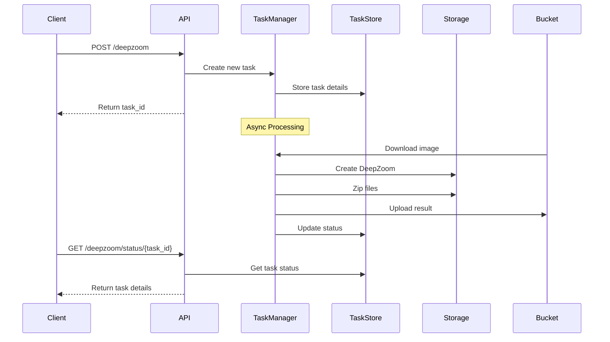

## DeepZoom API


[](https://www.codefactor.io/repository/github/ardabalkir/quint-deepzoom)

### Pyramiding
This application is an asynchronous endpoint for creating deep zoom image file formats for images, for use with EBrains related software. Main dependencies are `asyncio, aiofiles, aiohttp` and `fastapi`.


### API Endpoints
- `GET /deepzoom/health` - Service health status
- `POST /deepzoom` - Submit image processing task
- `GET /deepzoom/status/{task_id}` - Check task status

### Usage

```json
{
    "path" : "str",
    "target_path" : "str",
    "token" : "str"
}
  ```

Files paths should be submitted individually, for each file you will be assigned a `task_id`. You can query your tasks status with the status endpoint.


